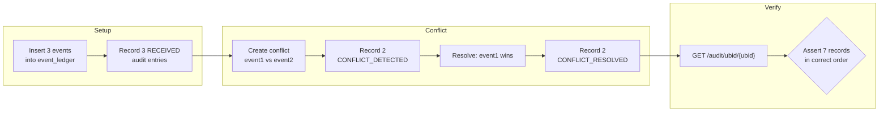
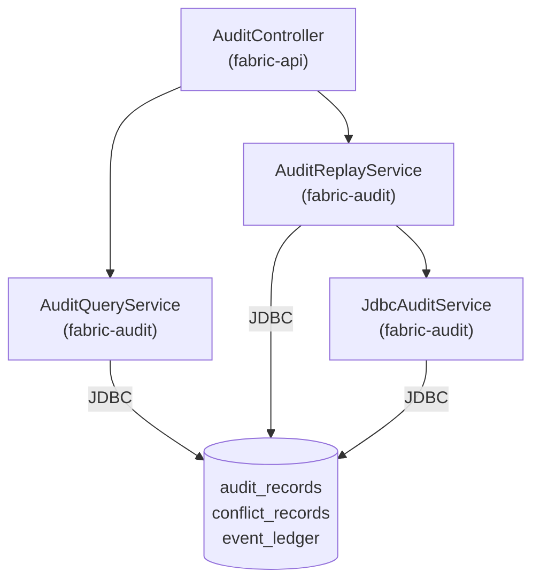

# AuditController & Integration Test — Implementation Summary

## Endpoints

### 1. `GET /api/v1/audit/ubid/{ubid}?from=ISO&to=ISO`
Returns all audit records for a UBID, ordered by timestamp ASC.

```json
{
  "ubid": "KA-2024-001",
  "events": [
    {
      "auditId": "...",
      "eventId": "...",
      "sourceSystem": "SWS",
      "targetSystem": null,
      "auditEventType": "RECEIVED",
      "timestamp": "2024-07-15T10:00:01Z",
      "conflictPolicy": null,
      "supersededBy": null,
      "beforeState": null,
      "afterState": null
    }
  ]
}
```

### 2. `GET /api/v1/audit/event/{eventId}`
Full lifecycle of one event across all audit records.

### 3. `GET /api/v1/conflicts?resolved=false&page=0&size=20`
Paginated conflict records enriched with event summaries:
```json
{
  "content": [{
    "conflictId": "...",
    "ubid": "...",
    "event1Summary": { "eventId": "...", "sourceSystemId": "SWS", "status": "RECEIVED" },
    "event2Summary": { "eventId": "...", "sourceSystemId": "DEPT_FACTORIES", "status": "SUPERSEDED" }
  }],
  "page": 0, "size": 20, "totalElements": 1
}
```

### 4. `POST /api/v1/audit/replay`
```json
// Request
{ "ubid": "KA-2024-001", "fromTimestamp": "2024-01-01T00:00:00Z", "dryRun": true }

// Response (dry run)
{
  "ubid": "KA-2024-001",
  "dryRun": true,
  "eventsFound": 3,
  "eventsReplayed": 3,
  "events": [
    { "eventId": "...", "action": "WOULD_REPLAY", "serviceType": "ADDRESS_CHANGE" }
  ]
}
```

---

## Files Created

| File | Module | Description |
|---|---|---|
| [AuditController.java](file:///c:/Users/shara/OneDrive/Desktop/WEB-DEV/Samanvay/karnataka-integration-fabric/fabric-api/src/main/java/com/karnataka/fabric/api/controller/AuditController.java) | `fabric-api` | REST controller with all 4 endpoints |
| [AuditQueryService.java](file:///c:/Users/shara/OneDrive/Desktop/WEB-DEV/Samanvay/karnataka-integration-fabric/fabric-audit/src/main/java/com/karnataka/fabric/audit/AuditQueryService.java) | `fabric-audit` | Read-only query service for audit/conflict data |
| [AuditReplayService.java](file:///c:/Users/shara/OneDrive/Desktop/WEB-DEV/Samanvay/karnataka-integration-fabric/fabric-audit/src/main/java/com/karnataka/fabric/audit/AuditReplayService.java) | `fabric-audit` | Event replay service (dry-run + live) |
| [AuditConflictIntegrationTest.java](file:///c:/Users/shara/OneDrive/Desktop/WEB-DEV/Samanvay/karnataka-integration-fabric/fabric-api/src/test/java/com/karnataka/fabric/api/controller/AuditConflictIntegrationTest.java) | `fabric-api` (test) | Integration test — 5 test methods |

---

## Integration Test Coverage



| Test | Endpoint | Assertion |
|---|---|---|
| `auditConflictLifecycle` | `GET /audit/ubid/{ubid}` | 7 records: 3 RECEIVED + 2 DETECTED + 2 RESOLVED, ordered ASC |
| `auditByEventId` | `GET /audit/event/{id}` | 2 records: RECEIVED + DISPATCHED for a single event |
| `unresolvedConflicts` | `GET /conflicts?resolved=false` | Paginated result with event summaries, `winningEventId` is null |
| `replayDryRun` | `POST /audit/replay` | `eventsFound=2`, no outbox entries created |
| `auditWithTimeWindowFilter` | `GET /audit/ubid/{ubid}?from=&to=` | Time window correctly filters results |

---

## Architecture


