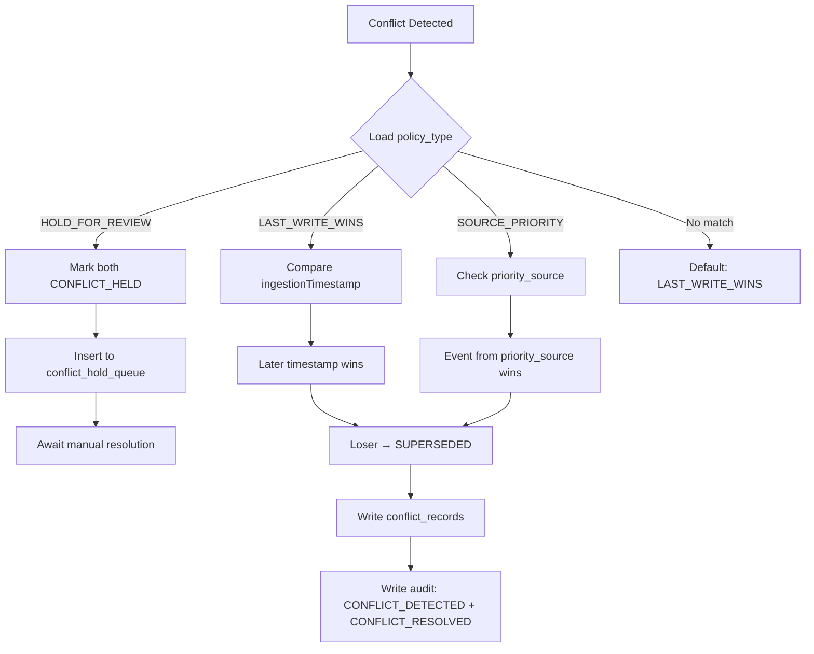

# Conflict Resolution — Implementation Summary

## Flyway Migrations

### V10 — `conflict_policies` (replaced)

| Column | Type | Notes |
|---|---|---|
| `policy_id` | UUID PK | auto-generated |
| `dept_id` | TEXT | NULL = any department (wildcard) |
| `service_type` | TEXT | e.g. `ADDRESS_CHANGE`, `SIGNATORY_UPDATE` |
| `field_name` | TEXT | NULL = any field (wildcard) |
| `policy_type` | TEXT | `LAST_WRITE_WINS` \| `SOURCE_PRIORITY` \| `HOLD_FOR_REVIEW` |
| `priority_source` | TEXT | e.g. `SWS`, `FACTORIES` (used when `SOURCE_PRIORITY`) |
| `active` | BOOLEAN | default `true` |

**Seed data:**

| service_type | dept_id | field_name | policy_type | priority_source |
|---|---|---|---|---|
| `ADDRESS_CHANGE` | any | any | `SOURCE_PRIORITY` | `SWS` |
| `SIGNATORY_UPDATE` | `FACTORIES` | any | `SOURCE_PRIORITY` | `FACTORIES` |
| `OWNERSHIP_CHANGE` | any | any | `HOLD_FOR_REVIEW` | — |
| *(no match)* | — | — | `LAST_WRITE_WINS` | — |

### V11 — `conflict_hold_queue` (new)

| Column | Type | Notes |
|---|---|---|
| `hold_id` | UUID PK | auto-generated |
| `conflict_id` | UUID | FK → `conflict_records` |
| `event_id` | UUID | the held event |
| `ubid` | TEXT | business entity |
| `service_type` | TEXT | mutation category |
| `source_system_id` | TEXT | originating system |
| `payload` | JSONB | event payload snapshot |
| `held_at` | TIMESTAMPTZ | when parked |
| `resolved_at` | TIMESTAMPTZ | NULL until resolved |
| `resolved_by_user` | TEXT | operator who resolved |
| `status` | TEXT | `HELD` \| `RELEASED` \| `DISCARDED` |

---

## Java Files Created / Modified

### New Files

| File | Description |
|---|---|
| [ConflictResolutionService.java](file:///c:/Users/shara/OneDrive/Desktop/WEB-DEV/Samanvay/karnataka-integration-fabric/fabric-propagation/src/main/java/com/karnataka/fabric/propagation/conflict/ConflictResolutionService.java) | Core `@Service` — `resolve()` and `resolveManually()` |
| [ResolvedConflict.java](file:///c:/Users/shara/OneDrive/Desktop/WEB-DEV/Samanvay/karnataka-integration-fabric/fabric-propagation/src/main/java/com/karnataka/fabric/propagation/conflict/ResolvedConflict.java) | Return record for resolution outcomes |
| [ConflictPolicy.java](file:///c:/Users/shara/OneDrive/Desktop/WEB-DEV/Samanvay/karnataka-integration-fabric/fabric-propagation/src/main/java/com/karnataka/fabric/propagation/conflict/ConflictPolicy.java) | Domain record mapping to `conflict_policies` table |
| [ConflictResolutionController.java](file:///c:/Users/shara/OneDrive/Desktop/WEB-DEV/Samanvay/karnataka-integration-fabric/fabric-api/src/main/java/com/karnataka/fabric/api/controller/ConflictResolutionController.java) | REST endpoint for manual resolution |

### Modified Files

| File | Change |
|---|---|
| [ConflictResolutionPolicy.java](file:///c:/Users/shara/OneDrive/Desktop/WEB-DEV/Samanvay/karnataka-integration-fabric/fabric-propagation/src/main/java/com/karnataka/fabric/propagation/conflict/ConflictResolutionPolicy.java) | Renamed `LAST_WRITER_WINS` → `LAST_WRITE_WINS`, `MANUAL_REVIEW` → `HOLD_FOR_REVIEW` |
| [ConflictDetector.java](file:///c:/Users/shara/OneDrive/Desktop/WEB-DEV/Samanvay/karnataka-integration-fabric/fabric-propagation/src/main/java/com/karnataka/fabric/propagation/conflict/ConflictDetector.java) | Updated SQL query for new `policy_type` column + wildcard matching |
| [PropagationOrchestrator.java](file:///c:/Users/shara/OneDrive/Desktop/WEB-DEV/Samanvay/karnataka-integration-fabric/fabric-propagation/src/main/java/com/karnataka/fabric/propagation/PropagationOrchestrator.java) | Aligned switch cases with renamed enum values |
| [local-schema.sql](file:///c:/Users/shara/OneDrive/Desktop/WEB-DEV/Samanvay/karnataka-integration-fabric/fabric-api/src/main/resources/local-schema.sql) | Updated H2 schema + seed data |
| [test-schema.sql](file:///c:/Users/shara/OneDrive/Desktop/WEB-DEV/Samanvay/karnataka-integration-fabric/fabric-api/src/test/resources/test-schema.sql) | Updated H2 test schema + seed data |
| [AuditRecordJsonTest.java](file:///c:/Users/shara/OneDrive/Desktop/WEB-DEV/Samanvay/karnataka-integration-fabric/fabric-core/src/test/java/com/karnataka/fabric/core/domain/AuditRecordJsonTest.java) | Aligned test data with new enum names |
| [ConflictRecordJsonTest.java](file:///c:/Users/shara/OneDrive/Desktop/WEB-DEV/Samanvay/karnataka-integration-fabric/fabric-core/src/test/java/com/karnataka/fabric/core/domain/ConflictRecordJsonTest.java) | Aligned test data with new enum names |

---

## Resolution Strategies



## REST Endpoint

```
POST /api/v1/conflicts/{conflictId}/resolve
Content-Type: application/json

{
  "winnerEventId": "550e8400-e29b-41d4-a716-446655440000"
}
```

**Responses:**
- `200 OK` — returns `ResolvedConflict` JSON
- `400 Bad Request` — invalid conflict ID or winner event not part of conflict
- `409 Conflict` — conflict already resolved
