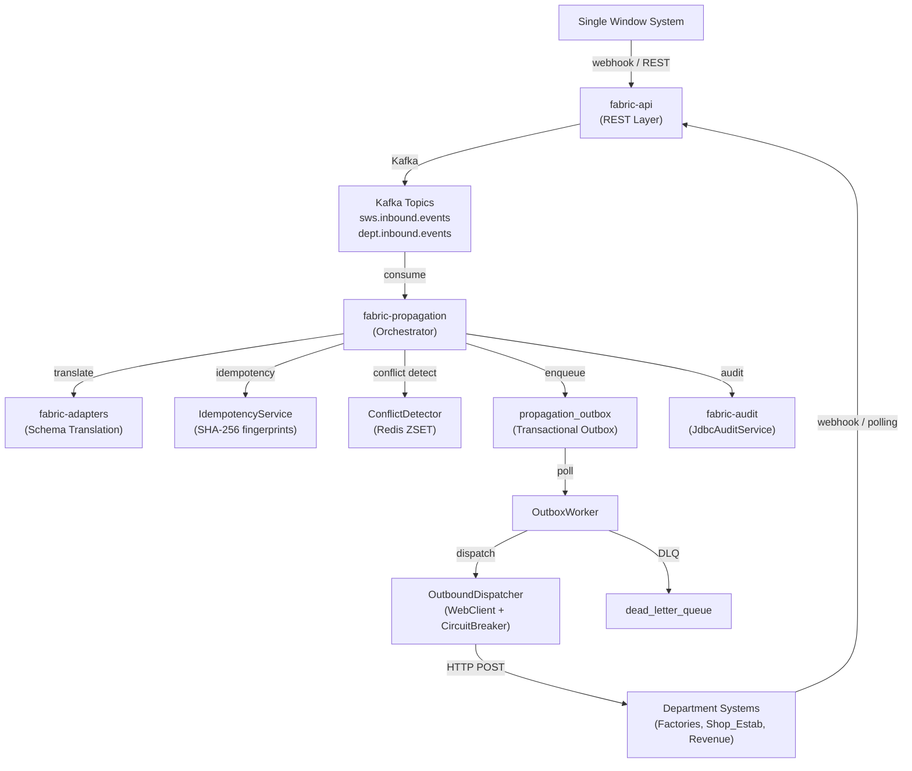

# Karnataka Integration Fabric — Handoff Report

**Date**: 2026-05-07  
**Project**: Karnataka Single Window Integration Fabric  
**Repo**: `/Users/cruise/Desktop/HCKTHN/karnataka-integration-fabric`  
**Context**: Hackathon project — event-driven middleware connecting Karnataka's Single Window System (SWS) with multiple government department systems (Factories, Shops & Establishments, Revenue).

---

## 1. High-Level Architecture



### Tech Stack
- **Java 21** + **Spring Boot 3.x** + **Maven** (multi-module)
- **PostgreSQL 16** (production) / **H2** (test/local)
- **Kafka** (Confluent 7.5) for async event streaming
- **Redis 7** for conflict detection ZSET windows
- **Resilience4j** for circuit breakers on outbound calls
- **Flyway** for DB migrations
- **WireMock** for mock department APIs
- **Docker Compose** for full-stack local infra

---

## 2. Module Structure

```
karnataka-integration-fabric/
├── fabric-core/          # Domain models, enums, service interfaces, Flyway migrations
├── fabric-adapters/      # Dept registry, schema mappings, translators, polling/webhook/snapshot adapters
├── fabric-propagation/   # Orchestrator, idempotency, conflict, outbox, dispatch, DLQ
├── fabric-audit/         # JdbcAuditService (writes to audit_records table)
├── fabric-api/           # REST controllers, Spring Boot main class, integration tests
├── stubs/                # WireMock stubs for mock dept systems (factories, shop_estab, revenue, sws)
├── docker-compose.yml    # Postgres, Redis, Kafka, WireMock containers
└── pom.xml               # Parent POM with dependency management
```

> [!IMPORTANT]
> The main Spring Boot app is in `fabric-api` with `@SpringBootApplication(scanBasePackages = "com.karnataka.fabric")` — it scans all modules.

---

## 3. What Has Been Built (COMPLETED)

### 3.1 fabric-core (Domain Layer)

| File | Status | Purpose |
|------|--------|---------|
| `CanonicalServiceRequest.java` | ✅ | Java 21 record — the canonical event format (eventId, ubid, sourceSystemId, serviceType, payload, checksum, status) |
| `ConflictRecord.java` | ✅ | Record for detected conflicts between events |
| `AuditRecord.java` | ✅ | Immutable audit trail entry |
| `AuditEventType.java` | ✅ | Enum: RECEIVED, TRANSLATED, DISPATCHED, CONFIRMED, FAILED, CONFLICT_DETECTED, CONFLICT_RESOLVED, RETRY_QUEUED, DLQ_PARKED, SCHEMA_DRIFT_DETECTED |
| `PropagationStatus.java` | ✅ | Enum: RECEIVED, PENDING, DELIVERED, FAILED, SUPERSEDED, CONFLICT_HELD |
| `FieldTransform.java` | ✅ | Enum for field transforms (UPPERCASE, LOWERCASE, NONE, SPLIT_FULLNAME_TO_FIRST_LAST, CONCAT_ADDRESS_LINES) |
| `AuditService.java` | ✅ | Interface with `recordAudit(eventId, ubid, source, target, eventType, beforeState, afterState)` |
| `KafkaTopicConfig.java` | ✅ | Auto-creates Kafka topics from config |

**Flyway Migrations (V1–V10):**
| Migration | Tables |
|-----------|--------|
| V1 | `event_ledger`, `idempotency_fingerprints`, `audit_records`, `conflict_records` |
| V2 | `pending_ubid_resolution` |
| V3 | `poll_cursors` |
| V4 | `snapshot_hashes` |
| V5 | `schema_mappings` (with seed data for FACTORIES/SHOP_ESTAB ADDRESS_CHANGE mappings) |
| V6 | `drift_alerts` |
| V7 | `propagation_outbox` |
| V8 | `dead_letter_queue` |
| V9 | `idempotency_fingerprints` (already in V1, this adds comments) |
| V10 | `conflict_policies` (with seeded ADDRESS_CHANGE policies) |

---

### 3.2 fabric-adapters (Inbound + Translation Layer)

| Component | Status | Purpose |
|-----------|--------|---------|
| `DepartmentRegistry` | ✅ | Loads dept JSON configs from classpath (`departments/*.json`), provides `getConfig(deptId)`, `allConfigs()`, `getNormaliser(deptId)` |
| `DepartmentConfig` | ✅ | Record: deptId, displayName, adapterMode (POLLING/WEBHOOK), webhookPath, pollUrl, snapshotUrl, pollIntervalSeconds, mappingFile |
| `SchemaTranslatorService` | ✅ | Translates `CanonicalServiceRequest` → dept-specific payload using mapping rules from `schema_mappings` table |
| `TranslationResult` | ✅ | Record: success, translatedPayload, warnings, mappingVersion |
| `TransformEngine` | ✅ | Applies field transforms (UPPERCASE, LOWERCASE, SPLIT_FULLNAME, CONCAT_ADDRESS_LINES) |
| `MappingRepository` | ✅ | JPA repo for `SchemaMapping` entity |
| `PollingAdapter` | ✅ | Scheduled polling from dept APIs with circuit breaker |
| `SnapshotDiffAdapter` | ✅ | Periodic full-snapshot diff detection |
| `WebhookNormaliser` | ✅ | Normalises raw dept webhook JSON → CanonicalServiceRequest |
| `SchemaDriftDetector` | ✅ | Detects missing fields in dept API responses vs expected schema |
| `InboundIngestionService` | ✅ | Publishes canonical events to Kafka (sws.inbound.events / dept.inbound.events) |

**Department Configs** (JSON files in `departments/`):
- `factories.json` — WEBHOOK mode
- `shop_estab.json` — POLLING mode
- `revenue.json` — exists but mode/details TBD

---

### 3.3 fabric-propagation (Event Distribution Layer)

| Component | Status | Purpose |
|-----------|--------|---------|
| **PropagationOrchestrator** | ✅ | Main entry point: resolve targets → translate → idempotency → conflict detect → outbox insert → audit |
| **PropagationEventConsumer** | ✅ | `@KafkaListener` on `sws.inbound.events` + `dept.inbound.events`, deserialises JSON → `CanonicalServiceRequest` → calls orchestrator |
| **IdempotencyService** | ✅ | SHA-256 fingerprint-based lock (`acquireLock`, `commitLock`, `releaseLock`) with 5-min stale lock reclaim, pessimistic `SELECT FOR UPDATE` |
| **IdempotencyResult** | ✅ | Enum: PROCEED, DUPLICATE_SKIP, LOCK_ACQUIRED |
| **ConflictDetector** | ✅ | Redis ZSET windowed detection (`ZADD` + `ZRANGEBYSCORE`), field comparison from `event_ledger`, policy from `conflict_policies` table |
| **ConflictCheckResult** | ✅ | Record: conflictDetected, conflictingEventId, fieldInDispute, policyToApply |
| **ConflictResolutionPolicy** | ✅ | Enum: LAST_WRITER_WINS, SOURCE_PRIORITY, MANUAL_REVIEW |
| **OutboxWorker** | ✅ | `@Scheduled` fixed-delay poller, picks PENDING outbox rows, dispatches via OutboundDispatcher, exponential backoff retries (5 attempts: 0s, 30s, 120s, 300s, 600s), moves to DLQ after exhaustion |
| **OutboxEntry** | ✅ | JPA entity for `propagation_outbox` table |
| **OutboxRepository** | ✅ | `findPendingForProcessing(now)` with `PESSIMISTIC_WRITE` lock + `SKIP LOCKED` |
| **OutboundDispatcher** | ✅ | `@Service` with per-dept Resilience4j `CircuitBreaker('dispatch-{targetSystemId}')`. Returns `PropagationResult` (SUCCESS / PERMANENT_FAILURE / TRANSIENT_FAILURE) based on HTTP status |
| **PropagationResult** | ✅ | Enum: SUCCESS, PERMANENT_FAILURE (4xx except 429), TRANSIENT_FAILURE (5xx/429/timeout) |
| **DeadLetterEntry** | ✅ | JPA entity for `dead_letter_queue` table |
| **DeadLetterRepository** | ✅ | JPA repo for DLQ |

> [!NOTE]
> `ConflictDetector` uses `@ConditionalOnBean(StringRedisTemplate.class)` — only loads when Redis is available.
> `PropagationOrchestrator` accepts `Optional<ConflictDetector>` — gracefully skips conflict detection when absent (tests, local dev).

---

### 3.4 fabric-audit

| Component | Status | Purpose |
|-----------|--------|---------|
| **JdbcAuditService** | ✅ | Implements `AuditService`. Writes to `audit_records` table via `JdbcTemplate`. Uses portable SQL (no PostgreSQL-specific casts). |

---

### 3.5 fabric-api (REST + Integration Tests)

**Controllers:**
| Controller | Endpoint | Status |
|-----------|----------|--------|
| `SWSInboundController` | `POST /api/v1/inbound/sws` | ✅ |
| `WebhookAdapterController` | `POST /api/v1/inbound/{deptId}` | ✅ |
| `TranslationDryRunController` | `POST /api/v1/translate/dry-run` | ✅ |
| `MappingAdminController` | `GET/POST/PUT /api/v1/mappings` | ✅ |
| `DriftAlertController` | `GET /api/v1/drift-alerts` | ✅ |
| `EventController` | `GET /api/v1/events` | ✅ |
| `HealthController` | `GET /api/v1/health` | ✅ |

**Integration Tests:**
| Test Class | Status | What It Tests |
|-----------|--------|---------------|
| `PropagationIntegrationTest` | ✅ | Full pipeline: SWS event → translated outbox entries for FACTORIES + SHOP_ESTAB → audit DISPATCHED → duplicate skipped via idempotency |
| `SchemaDriftDetectorIntegrationTest` | ✅ | Drift detection + API visibility |
| `WebhookAdapterControllerIntegrationTest` | ✅ | Dept webhook ingestion flow |
| `MappingAdminControllerIntegrationTest` | ✅ | CRUD for schema mappings |
| `TranslationDryRunControllerIntegrationTest` | ✅ | Translation dry-run API |
| `IdempotencyServiceConcurrentTest` | ✅ | 10-thread CyclicBarrier concurrent lock acquisition |
| `OutboxWorkerTest` | ✅ | Outbox processing + retry + DLQ |

---

## 4. Configuration Summary

### application.yml (production)
```yaml
spring.datasource: PostgreSQL (localhost:5432/fabric_db)
spring.kafka: localhost:9092
spring.data.redis: localhost:6379
fabric.kafka.topics: sws-inbound, dept-inbound, propagation-outbound, audit-trail, conflict-detected, dlq
outbox.worker.fixedDelay: 5000ms
conflict.window.seconds: 30
resilience4j: default CB (sliding-window=10, failure-rate=50%, wait=30s)
```

### application-test.yml
```yaml
spring.datasource: H2 in-memory (PostgreSQL mode)
spring.flyway: disabled (uses test-schema.sql)
spring.autoconfigure.exclude: RedisAutoConfiguration (no Redis in tests)
conflict.window.seconds: 5
outbox.worker.fixedDelay: 999999999 (disabled)
```

### application-local.yml
```yaml
spring.datasource: H2 in-memory
spring.autoconfigure.exclude: KafkaAutoConfiguration, RedisAutoConfiguration
spring.sql.init: local-schema.sql
```

---

## 5. Database Schema (10 Tables)

| Table | Key Columns | Purpose |
|-------|-------------|---------|
| `event_ledger` | event_id (PK), ubid, source_system_id, service_type, payload (JSONB), status | Master event store |
| `audit_records` | audit_id (PK), event_id, ubid, audit_event_type, before_state, after_state | Full audit trail |
| `idempotency_fingerprints` | fingerprint (PK), status (IN_FLIGHT/COMMITTED), locked_at | Exactly-once delivery locks |
| `conflict_records` | conflict_id (PK), ubid, event1_id, event2_id, resolution_policy, winning_event_id, field_in_dispute | Detected conflict audit |
| `conflict_policies` | policy_id (PK), service_type, field_name, policy (LAST_WRITER_WINS/SOURCE_PRIORITY/MANUAL_REVIEW) | Configurable resolution policies |
| `propagation_outbox` | outbox_id (PK), event_id, ubid, target_system_id, translated_payload, status, attempt_count, next_attempt_at | Transactional outbox |
| `dead_letter_queue` | dlq_id (PK), event_id, failure_reason | Failed events after retry exhaustion |
| `schema_mappings` | mapping_id (PK), dept_id, service_type, version, mapping_rules (JSON) | Field mapping rules |
| `drift_alerts` | id (PK), dept_id, missing_fields | Schema drift detections |
| `pending_ubid_resolution` | id (PK), dept_id, dept_record_id, raw_payload, status | Parked events awaiting UBID resolution |
| `poll_cursors` | dept_id (PK), last_cursor | Polling watermarks |
| `snapshot_hashes` | (dept_id, record_key) PK, hash | Snapshot diff detection |

---

## 6. What Remains To Be Done

### Priority 1: Critical Path (Must Have)

#### 6.1 End-to-End Kafka Integration Test
**Status**: ❌ Not done  
**Why**: Current `PropagationIntegrationTest` bypasses Kafka (calls orchestrator directly). Need to verify the full path: HTTP POST → Kafka publish → consume → orchestrator → outbox.  
**How**: Use `spring-kafka-test` with `@EmbeddedKafka` annotation. The dependency already exists in `fabric-propagation/pom.xml`.

#### 6.2 OutboxWorker ↔ OutboundDispatcher Integration
**Status**: ⚠️ Partial  
**Why**: `OutboxWorker` still calls `dispatcher.dispatch()` (legacy method that throws on failure). Should be updated to use `dispatchWithResult()` returning `PropagationResult` for granular retry control (skip retry on `PERMANENT_FAILURE`).  
**File**: `OutboxWorker.java` → `processEntry()` method  
**What to change**: Replace `outboundDispatcher.dispatch(...)` with `outboundDispatcher.dispatchWithResult(...)` and switch on the `PropagationResult` enum to decide retry vs DLQ.

#### 6.3 Event Ledger Persistence on Ingestion
**Status**: ⚠️ Not verified  
**Why**: The `InboundIngestionService` publishes events to Kafka, but it's unclear whether events are also persisted to `event_ledger` before publishing. The `ConflictDetector.identifyFieldInDispute()` loads payloads from `event_ledger` — this will fail if events aren't persisted there.  
**Files to check**: `InboundIngestionService.java` in `fabric-adapters`  
**Fix needed**: Ensure every ingested event is written to `event_ledger` (with payload as JSONB) before or during Kafka publish.

#### 6.4 Conflict Detection — Redis Integration Test
**Status**: ❌ Not done  
**Why**: `ConflictDetector` is excluded from Spring context in tests (`@ConditionalOnBean` + Redis excluded). Need a dedicated test with embedded Redis or Testcontainers.  
**How**: Add `it.ozimov:embedded-redis` or `com.redis.testcontainers:testcontainers-redis` test dependency to `fabric-propagation/pom.xml`. Write `ConflictDetectorIntegrationTest` with two events for the same UBID within the window.

### Priority 2: Important (Should Have)

#### 6.5 Conflict Resolution — MANUAL_REVIEW Workflow
**Status**: ⚠️ Stubbed  
**Why**: The `MANUAL_REVIEW` policy holds both events (neither proceeds), but there's no REST endpoint or mechanism to manually resolve held conflicts.  
**What to build**:
- `GET /api/v1/conflicts?status=PENDING` — list unresolved conflicts
- `POST /api/v1/conflicts/{conflictId}/resolve` — body: `{ "winningEventId": "..." }` → re-propagate winner, mark loser SUPERSEDED

#### 6.6 DLQ Management Endpoints
**Status**: ❌ Not done  
**Why**: Dead-lettered events can only be seen via direct DB query. Need admin endpoints.  
**What to build**:
- `GET /api/v1/dlq` — list dead-letter entries
- `POST /api/v1/dlq/{dlqId}/retry` — re-enqueue to outbox for retry
- `POST /api/v1/dlq/{dlqId}/resolve` — mark as manually resolved

#### 6.7 Outbox Monitoring Endpoint
**Status**: ❌ Not done  
**What to build**:
- `GET /api/v1/outbox/stats` — returns counts by status (PENDING, FAILED, etc.)
- Could also expose as Actuator metrics via Micrometer

#### 6.8 WireMock Stubs Completion
**Status**: ⚠️ Directory exists but stubs may be incomplete  
**Location**: `stubs/factories/`, `stubs/shop_estab/`, `stubs/revenue/`, `stubs/sws/`  
**What to do**: Verify each stub directory has proper `__files/` and `mappings/` directories with JSON response stubs matching expected department API contracts.

### Priority 3: Nice to Have (Stretch Goals)

#### 6.9 Metrics & Observability
- Add Micrometer counters for: events ingested, events propagated, conflicts detected, retries exhausted, DLQ parked
- Expose via `/actuator/prometheus` (Actuator already configured in `application.yml`)

#### 6.10 UBID Registry Lookup
**Status**: ⚠️ Simplified  
**Current**: `PropagationOrchestrator.resolveTargets()` sends SWS-origin events to ALL registered depts. In production, it should look up which depts the specific UBID is registered with.  
**What to build**: A `ubid_registry` table mapping UBIDs to department IDs, and query it in `resolveTargets()`.

#### 6.11 Batch / Bulk Event Ingestion
- Add `POST /api/v1/inbound/sws/batch` for bulk event submission
- Useful for initial data loads

#### 6.12 Revenue Department Adapter
**Status**: ⚠️ Config exists (`departments/revenue.json`) but no mapping rules in `schema_mappings`  
**What to do**: Add REVENUE/ADDRESS_CHANGE mapping rules (V11 migration or seed data).

---

## 7. How to Run

### Local (H2, no Docker)
```bash
./mvnw spring-boot:run -pl fabric-api -Dspring-boot.run.profiles=local
# App at http://localhost:8080
# H2 console at http://localhost:8080/h2-console
```

### Docker Compose (full stack)
```bash
docker-compose up -d
# Postgres :5432, Kafka :9092, Redis :6379
# SWS mock :8081, Factories mock :8082, Shop_Estab mock :8083, Revenue mock :8084
# App :8080
```

### Run Tests
```bash
# All tests
./mvnw test

# Specific test classes
./mvnw -pl fabric-api -am test -Dtest="PropagationIntegrationTest"
./mvnw -pl fabric-propagation -am test -Dtest="IdempotencyServiceConcurrentTest"
```

---

## 8. Key Code Entry Points

| What | File | Location |
|------|------|----------|
| Spring Boot main | `FabricApiApplication.java` | `fabric-api/src/.../api/` |
| REST ingestion (SWS) | `SWSInboundController.java` | `fabric-api/src/.../controller/` |
| REST ingestion (Dept) | `WebhookAdapterController.java` | `fabric-api/src/.../controller/` |
| Kafka consumer | `PropagationEventConsumer.java` | `fabric-propagation/src/.../propagation/` |
| **Main orchestrator** | `PropagationOrchestrator.java` | `fabric-propagation/src/.../propagation/` |
| Idempotency | `IdempotencyService.java` | `fabric-propagation/src/.../idempotency/` |
| Conflict detection | `ConflictDetector.java` | `fabric-propagation/src/.../conflict/` |
| Outbox polling | `OutboxWorker.java` | `fabric-propagation/src/.../outbox/` |
| HTTP dispatch | `OutboundDispatcher.java` | `fabric-propagation/src/.../dispatch/` |
| Schema translation | `SchemaTranslatorService.java` | `fabric-adapters/src/.../translation/` |
| Dept registry | `DepartmentRegistry.java` | `fabric-adapters/src/.../registry/` |
| Audit service | `JdbcAuditService.java` | `fabric-audit/src/.../audit/` |
| All config | `application.yml` | `fabric-api/src/main/resources/` |
| Test schema (H2) | `test-schema.sql` | `fabric-api/src/test/resources/` |
| Production migrations | `V1-V10__*.sql` | `fabric-core/src/main/resources/db/migration/` |

---

## 9. Known Caveats & Gotchas

> [!WARNING]
> **H2 vs PostgreSQL**: Test schema uses `CLOB` where production uses `JSONB`. The `JdbcAuditService` was fixed to avoid `?::uuid` / `?::jsonb` casts, but any NEW SQL queries must also avoid PostgreSQL-specific syntax if they need to run in tests.

> [!WARNING]
> **DepartmentRegistry.allConfigs()** returns `Collections.unmodifiableMap()`. Tests that need to override configs must use reflection to access the internal `configs` ConcurrentHashMap (see `PropagationIntegrationTest.setUp()` for the pattern).

> [!CAUTION]
> **Kafka auto-offset-reset is `earliest`** — in production this means a newly deployed consumer group will replay all messages from the beginning. This is intentional for the hackathon but should be changed for production.

> [!NOTE]
> **ConflictDetector is Optional** — when Redis is unavailable (tests, local dev), the orchestrator silently skips conflict detection. All tests currently run without Redis. The conflict detection path is untested in integration.

> [!NOTE]
> **OutboxWorker.fixedDelay is set to 999999999 in tests** to prevent the scheduled poller from interfering with test assertions. Tests call the orchestrator directly.

---

## 10. Dependency Versions (from parent pom.xml)

The parent POM uses Spring Boot's dependency management. Key dependencies:
- Spring Boot 3.x (starter-web, starter-data-jpa, starter-webflux, starter-data-redis, starter-actuator)
- Spring Kafka
- Resilience4j (resilience4j-spring-boot3)
- Jackson (databind + datatype-jsr310)
- H2 (test scope)
- MockWebServer (test scope in fabric-api)
- Lombok (provided scope)
- MapStruct (fabric-api only)
- SpringDoc OpenAPI 2.5.0 (Swagger UI)
